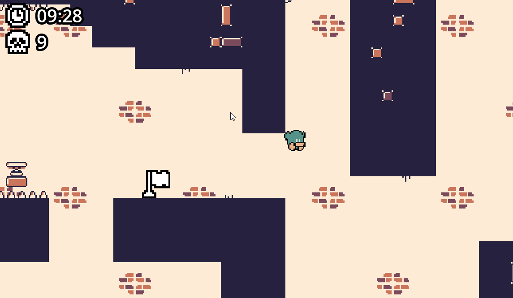

# 🏭 Escape From The Factory Game

> A dynamic 2D platformer game built with Godot Engine. The game heavily focuses on a tight movement system and navigating through challenging factory-themed obstacles (mainly spikes).

## 🎮 Gameplay Demo

## 🛠 Tech Stack

- **Game Engine:** Godot Engine
- **Language:** GDScript
- **Graphics & Game Design:** MS Paint, GIMP (Custom assets and level design)

## ⭐ Key Features

The project features comprehensive platformer mechanics and fully implemented core game systems:

- **Advanced Movement System:** Fluid character physics including double jump, wall jump, dash, and crouching.
- **Interactive Environment:** Moving obstacles, jump pads, and conveyor belts with spawning boxes that act as dynamic platforms.
- **Core Game Systems:**
  - Fully functional Main Menu and Pause Screen.
  - Save/Load state and Checkpoint system.
  - Player death handling and respawns.
  - Built-in Timer for speedrunning enthusiasts.

## 🚀 How to Run Locally

1. Download [Godot Engine](https://godotengine.org/download) (Version X.X - _put your version here, e.g., 3.5 or 4.2_).
2. Clone this repository: `git clone [your-repo-link]`
3. Open Godot, click `Import`, and select the `project.godot` file from the cloned folder.
4. Press `F5` (or click the Play button in the top right corner) to run the game!

## 🧠 What I Learned

Since this was a major Godot project for me, it was a huge learning experience. Key takeaways include:

- **Game Physics & Math:** I learned how to build and tweak custom movement physics from scratch to make the controls feel satisfying and responsive.
- **Complex Debugging:** I developed skills in diagnosing and fixing bugs that weren't just simple code errors (GDScript), but complex interactions between my logic and the game engine itself.
- **Game Design Basics:** Designing logical and challenging levels
- **Godot & GDScript Proficiency:** Navigating the Godot environment, managing scenes, nodes, and using signals effectively.
